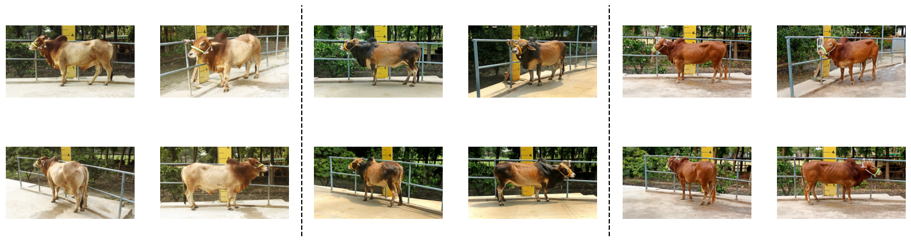
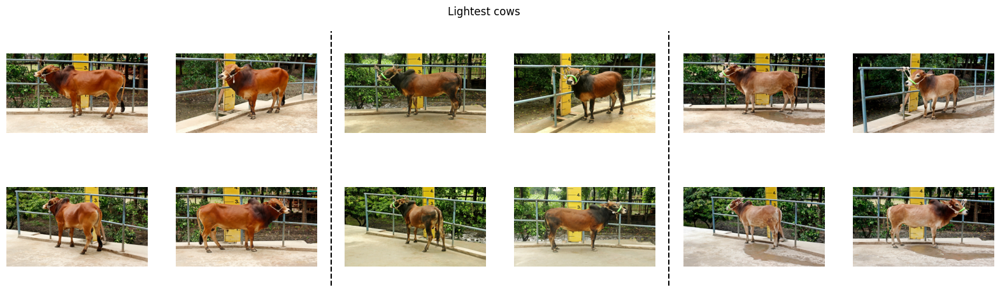
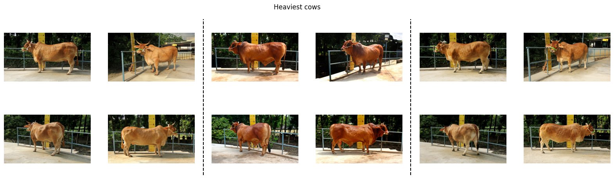
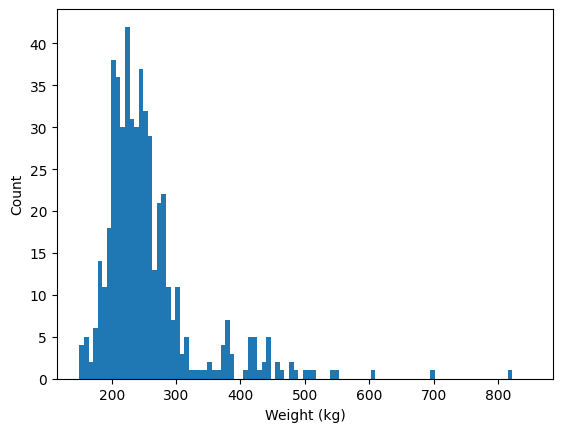

# Exploratory Data Analysis

_Findings from initial dataset exploration._

## Dataset summary

- Source: https://github.com/bhuiyanmobasshir94/CID
- N cows: 513
- N images: 2,052 (4 per cow) plus 15,872 (for the 512 cows with 31 YT images)
- Weight range (kg): 150kg - 816kg
- Image resolution: [800 x 450, 1200 x 675] (same aspect ratio)

## Example images

These are the 4 different angles for 3 randomly selected cows:

These are the 3 lightest cows:

These are the 3 heaviest cows:

## Observations

<!-- Add key observations here as you explore the data. -->

- Other than size/weight of the cows, the breed/colour will be the biggest variation between images.

- Distribution of weights is distributed in a way that would encourage excluding the upper tail of the dataset, or to find a way to emphasize/improve training in regions with limited data.

## Notebooks

See `notebooks/01_eda.ipynb` for interactive analysis.
